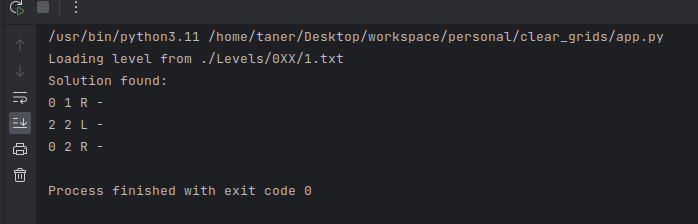

# NOTES:

I tried a couple of algorithms like BFS, DFS, A*, MCTS, Backtracking.
Also, I tried a couple of combinations :
- [x] MCTS with RL
- [x] BFS with backtracking
- [x] BFS after DFS
- [x] BFS/DFS with change start point every time

> First Algorithm : BFS kind a works but not really successfully with low time costs. Sametime bfs,
has some problems search tree and queue mechanism:

BFS mechanism works with non-visited tree system, 
this means if a number is visited, its position will be remembered for the next movement.
that's why, we cannot use this algorithm for the recursive calls.

> Also, DFS algorithm has same issue, at the same time DFS has more time cost than BFS.

However, I tried the DFS, and I got some problems with search tree and locating numbers. In this case, DFS works very slowly because it checks every grid one by one. Also, DFS couldn't even solve level one. Meantime, DFS seems very efficient for the case; honestly, it is not :)

**BFS AND DFS :**
- BFS works with breadth-first search, which traverses nodes layer by layer to find the shortest path. However, it cannot efficiently utilize memory, and the size of the search tree can quickly grow. Additionally, it may not be suitable for games like this because even at lower levels, there can be a large number of possible states.

- DFS works with depth-first search, progressing along a path until it finds a solution. If it fails to find a solution on a path, it backtracks and tries another path. DFS can use less memory than BFS in some cases, but it can take a very long time in certain situations and may not find a solution.

_PS: The Original version of this Game is [NumberShifting](https://www.codingame.com/multiplayer/optimization/number-shifting) I took a quick glance at for what they were talking about. I've seen the LAHC algorithm. Here an example: [link](https://github.com/marchete/Codingame/blob/master/Optimization/Number%20Shift/NumberShift_LAHC.cpp)_

"Late-Acceptance Hill Climbing" (LAHC) algorithm is a type of local search algorithm designed to optimize a specific state. It appears to be comparable to DFS because LAHC is a variant of DFS adapted for optimization purposes.

> Needs to talk about MCTS (Monte Carlo Tree Search):

This algorithm is very efficient, (Here is very big BUT) BUT this algorithm is not working alone (for this case), you need to use it with another algorithm like Reinforcement Learning (RL). At this point, the project will turn in to an AI project (I don't want to do this because of dataset.)

Also, each level is different, and I think even AI will not work here. That's why I just quickly looked at this and moved to the next algorithm.

> The A* (A-star) algorithm

This algorithm is an informed search algorithm used for finding the shortest path or the least-cost path in a graph or search tree. This algorithm combines the cost of a node and its estimated remaining cost to select the best option. A* algorithm is a combination of breadth-first search (BFS) and best-first search algorithms.

In this case uses the A* algorithm to find a sequence of moves that will solve the game for the given map. It uses a priority queue (heapq) to keep track of the possible moves based on their costs. The cost of each move is calculated as the sum of the distances from the source to the target position and from the target to the next position to be visited, considering the value of the number being moved.

The algorithm continues searching for valid moves until it finds an empty map, indicating that the game has been solved. It returns the path of moves taken to reach the solution.

Resources : 
- BFS [wiki](https://en.wikipedia.org/wiki/Breadth-first_search)
- DFS [wiki](https://en.wikipedia.org/wiki/Depth-first_search)
- A* [wiki](https://en.wikipedia.org/wiki/A*_search_algorithm)
- MCTS [wiki](https://en.wikipedia.org/wiki/Monte_Carlo_tree_search)
- RL [wiki](https://en.wikipedia.org/wiki/Reinforcement_learning)

## Links :

- [Breadth First Search or BFS for a Graph](https://www.geeksforgeeks.org/breadth-first-search-or-bfs-for-a-graph/)
- [A Comprehensive Guide to BFS Algorithm](https://www.linkedin.com/pulse/comprehensive-guide-breadth-first-search-algorithm-code-beat/)
- [Tutorial](https://www.hackerearth.com/practice/algorithms/graphs/breadth-first-search/tutorial/)

- [DFS Graph](http://opendatastructures.org/versions/edition-0.1e/ods-java/12_3_Graph_Traversal.html#SECTION001532000000000000000)
- [DFS Doc](https://www.boost.org/doc/libs/1_82_0/libs/graph/doc/depth_first_search.html)
- [Implementing the A* Algorithm in Python: A Step-by-Step Guide](https://saturncloud.io/blog/implementing-the-a-algorithm-in-python-a-stepbystep-guide/)
- [Implementation of A*](https://www.redblobgames.com/pathfinding/a-star/implementation.html)
- [Introduction to A*](http://theory.stanford.edu/~amitp/GameProgramming/AStarComparison.html)
